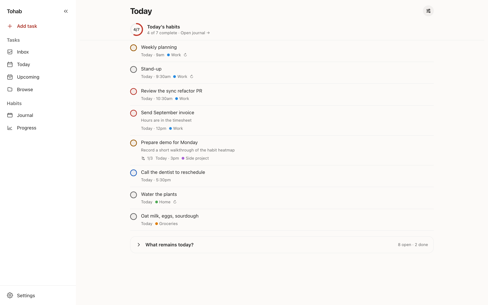

# Tohab

Tasks and habits in one daily journal. Tohab is an installable PWA that works fully offline and
syncs across your devices through a small server you host yourself.

<p>
  
  
  
  
</p>



## Features

- **Quick capture** — type `buy oat milk tomorrow 5pm p1 #groceries` and get the date, time,
  priority and project filled in.
- **Tasks** — Inbox, Today and Upcoming views, projects, priorities, repeating tasks, and a
  one-tap move for anything overdue.
- **Habits** — done/not-done or counted habits on daily, weekday or N-times-a-week schedules,
  with streaks, a 12-week heatmap you can backfill, and pauses that don't break your streak.
- **Offline-first** — everything works without a connection and syncs when one comes back.
- **Undo** — every completion, delete, carry-over and habit log can be undone, and an activity
  history shows what you changed.
- **Reminders and calendar** — Web Push reminders, an app badge, and a calendar feed for
  Google or iOS Calendar.
- **Yours** — self-hosted, single account, JSON backup and Todoist import, dark mode.

## Self-hosting

```bash
mkdir -p secrets && printf '%s\n' 'strong-password' > secrets/postgres_password
cp .env.example .env
docker compose up -d --build
```

Open `http://localhost:8080` on the host; for other devices, put it behind HTTPS (offline
use, installing and Web Push need it). The first account you create owns the server, and
registration closes after it. See [Self-hosting](docs/self-hosting.md) for configuration,
reminders and the calendar feed.

## Development

```bash
pnpm install
mkdir -p secrets && printf '%s\n' 'tohab' > secrets/postgres_password
pnpm dev     # Postgres in Docker, app on :5173, sync server on :5178
pnpm test
```

Built with SvelteKit, Svelte 5 and RxDB on the client, and Hono, Drizzle and Postgres on the
server.

## Documentation

- [Using Tohab](docs/using-tohab.md) — quick-add syntax, daily routine, habits, repeating
  tasks, activity history, calendar feed
- [Self-hosting](docs/self-hosting.md) — Docker Compose, configuration, Web Push, deploys
- [Development](docs/development.md) — local setup, database, tests
- [Architecture](docs/architecture.md) — sync protocol, authentication, undo model, design
  decisions

## License

Source-available under the [PolyForm Strict License 1.0.0](LICENSE): you may read, download and
run it for noncommercial purposes, but not modify it or redistribute it.
