# Using Tohab

Tohab keeps today's tasks and habits in one place. Tasks live in **Inbox**, **Today**,
**Upcoming** and **Browse**; habits live in **Journal** and **Progress**.

## Adding a task

The + button opens a quick-capture sheet with a title and chips for date, priority, project,
repeat and reminders, each expanding into a picker. It stays open after adding so several tasks
can go in one after another, and Done or Escape dismisses it.

The chips are two views of the same fields, so typing quick-add syntax in the title fills
them in live, and tapping a chip overrides whatever the parser found for that one field.

| Input | Result |
| --- | --- |
| `today`, `tomorrow`, `friday`, `next mon` | relative and weekday dates |
| `in 3 days`, `in 2 weeks`, `in 1 month` | offsets |
| `5 jan`, `jan 5`, `25/12`, `25/12/2027` | explicit dates (day-first) |
| `5pm`, `at 9`, `14:30`, `9:30am` | times; a bare time implies today |
| `every day`, `every other friday`, `every 3 weeks`, `every 15th` | recurrence |
| `p1`–`p4`, `!1`–`!4` or `!!1`–`!!4` | priority |
| `#work` | project, created on demand if new |

`buy oat milk tomorrow 5pm p1 #groceries` → title "buy oat milk", due tomorrow 17:00,
priority 1, in the Groceries project.

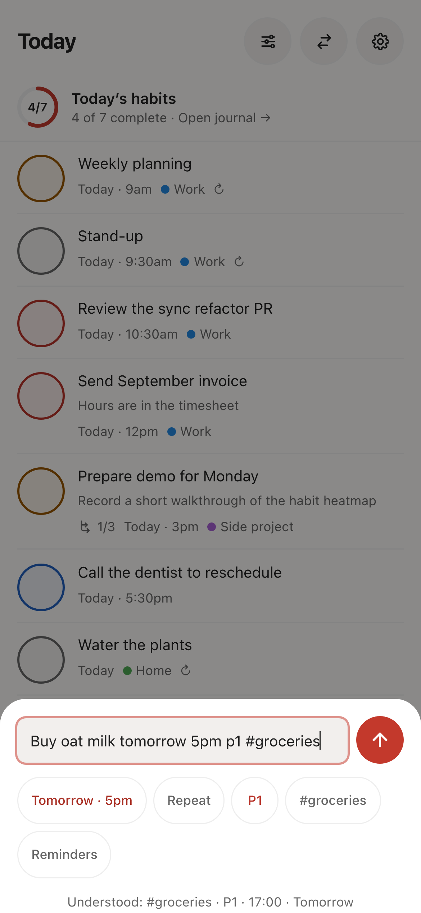

## A daily pass

Today is the working surface: overdue tasks are called out with a one-tap move to tomorrow or a
date you choose, Today also shows a compact habit completion summary,
and the bottom “What remains today?” prompt gives a quick wrap-up without turning the app into a
long-term archive. Completed work stays out of the daily list unless you turn on “Show completed
tasks” in the view options. Every carry-over, delete, completion, and habit log can be undone immediately.

  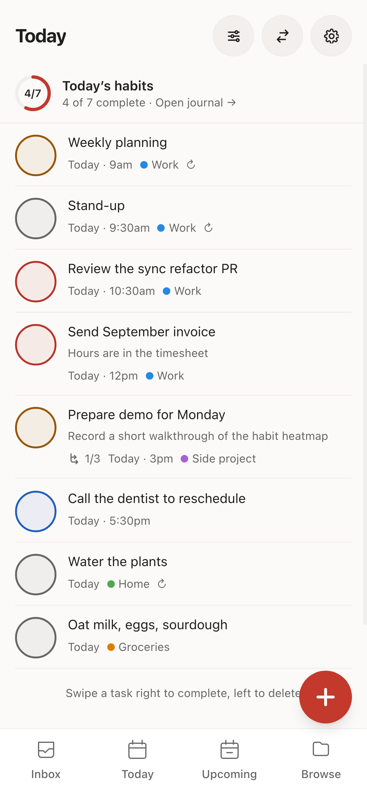
  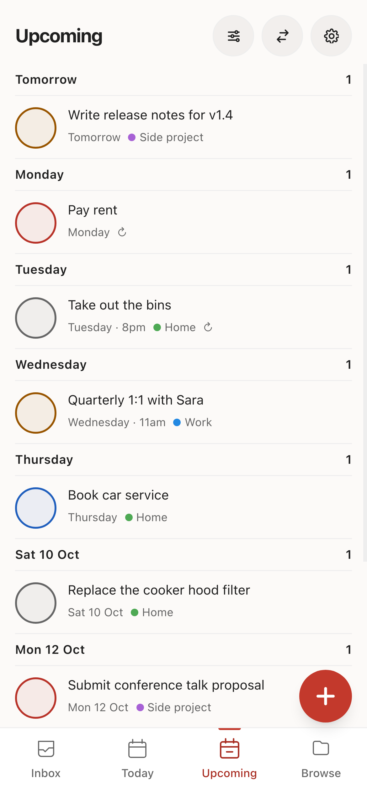

## Habits

Habits are either done/not done or counted (glasses of water, pages read), on one of three
schedules: daily, chosen weekdays, or N times per week. Streaks follow the schedule, the
12-week heatmap on each habit can be tapped to backfill a day, and archived habits keep their
history.

To pause a habit, open it from Progress, choose a date under “Take a pause”, and save. The pause
starts today and ends on the selected date; paused days are omitted from due counts and streak
gaps, while earlier entries remain intact. “Resume now” clears the window.

  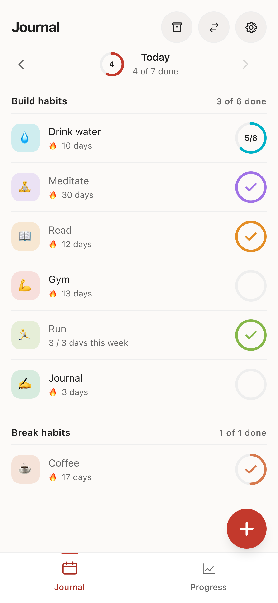
  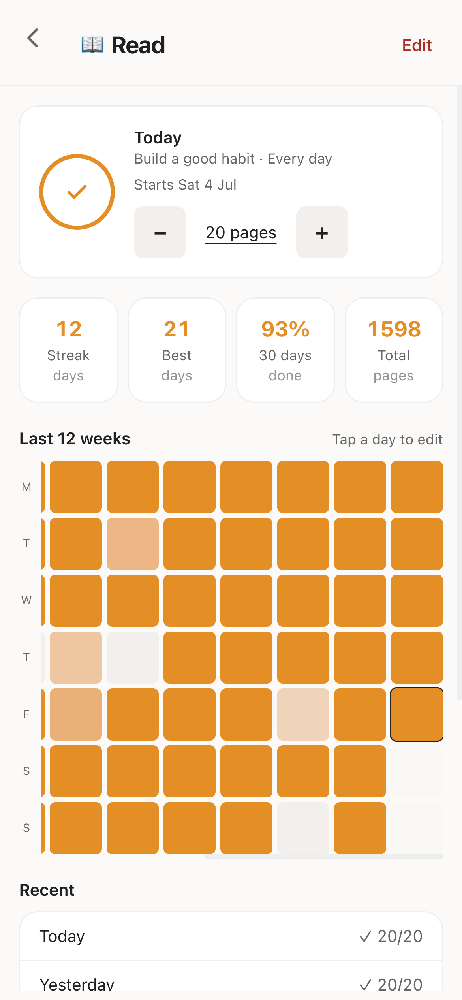
  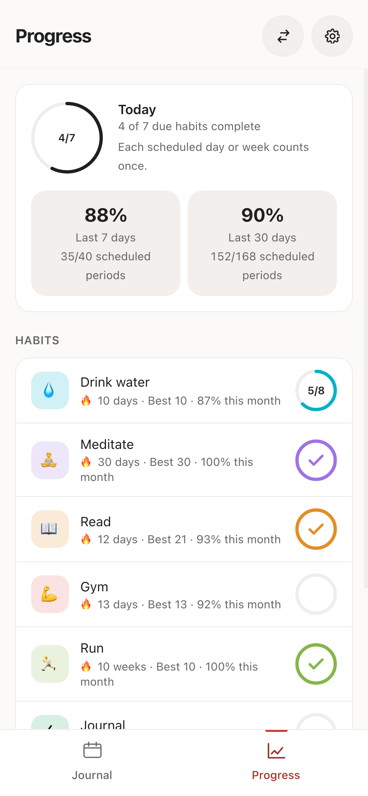

## Repeating tasks

A task can carry a recurrence rule, set from the Repeat chip or by typing one. Completing it
does not file it away: the due date moves to the next occurrence and the task stays open, so
the series *is* the task and there is one row for it rather than a graveyard of instances.

`daily`, `weekly`, `monthly` and `yearly` work as bare words, and `every …` takes an
interval (`every 3 days`, `every other week`), weekdays (`every friday`, `every mon, wed and
fri`, `every weekday`, `every weekend`) or a day of the month (`every 15th`). Todoist's
`every!` is supported too: `every! 10 days` counts from the day you complete it rather than
the day it was due, for the chores whose clock starts when you finish.

Two behaviours worth knowing. Completing an overdue repeating task rolls forward past today
rather than to a date already gone, so a daily task ignored for three weeks lands tomorrow.
And month-length overflow clamps rather than skips: `every 31st` falls on 28 February and is
back on the 31st in March.

Recurrence and Habits overlap on purpose but stay separate: recurrence is for dated work with
a next occurrence (bins, rent, filters), Habits are for things measured as a streak.

## Activity history

**Browse → Activity** lists what you have changed, newest first and grouped by day: tasks
and projects added, edited, completed or deleted, habits created or archived, days logged or
cleared. The history is read-only; undo is available only from the immediate toast after an
action. An undone entry stays in the list, struck through.

- **The log keeps the latest 200 entries.** Repeated taps on the same thing within ten
  seconds — a habit counter climbing to eight — fold into one entry rather than eight.
- **Undo restores documents, not the world around them.** If another device edited the same
  task in the meantime, undoing here overwrites that edit.

Entries are per account, not per device, so the history covers everything you did anywhere.
**Clear** empties it without touching the tasks and habits it describes.

## Reminders and badge

Reminders use Web Push. Each device can enable an automatic default for timed tasks, and a task
can inherit it, disable its reminder, fire at the due time, or choose a custom lead. On iPhone
and iPad, reminders need the app added to the Home Screen. Installed apps that support badging
show the current open-task count.

## Calendar feed

Settings → Calendar reveals a subscription URL you can add to Google Calendar (Other
calendars → From URL) or iOS Calendar. Open tasks with a due date become events: timed tasks
get a 30-minute block and date-only tasks become all-day events, and a repeating task shows up
as a whole series. The feed is schedule-only; Tohab's own push notifications handle reminders so
calendar clients do not produce duplicates.

Anyone holding the URL can read your tasks, so treat it like a password. Hosted calendars such
as Google need to reach your server from the internet to fetch it; see
[Self-hosting](self-hosting.md#calendar-feed).

## Backup

Settings → Data & storage exports a full JSON backup and imports it back. It can also import a
Todoist CSV export into your Inbox.

## Desktop and dark mode

On wider screens Tohab switches to a sidebar layout, and it follows the system's light or dark
appearance unless you choose one in Settings → Preferences.

  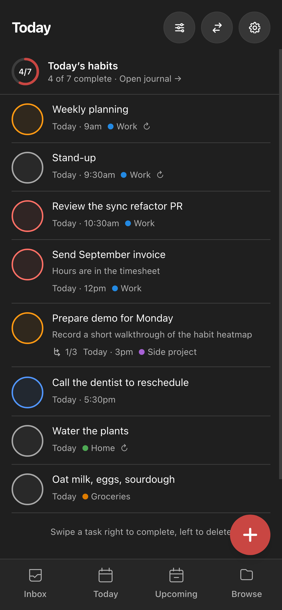
  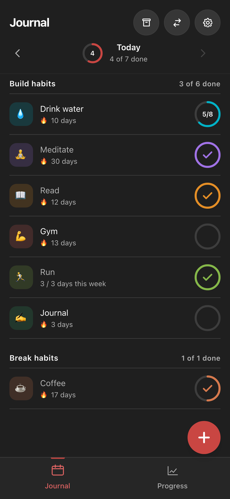

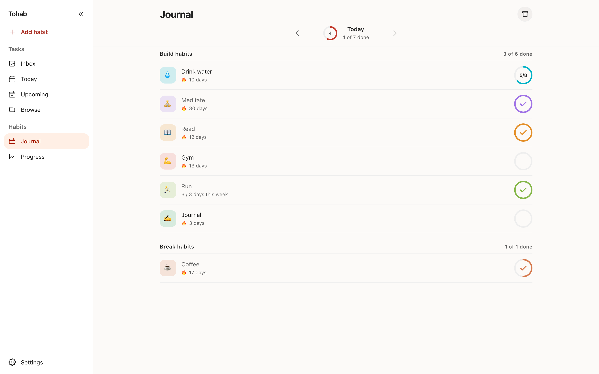

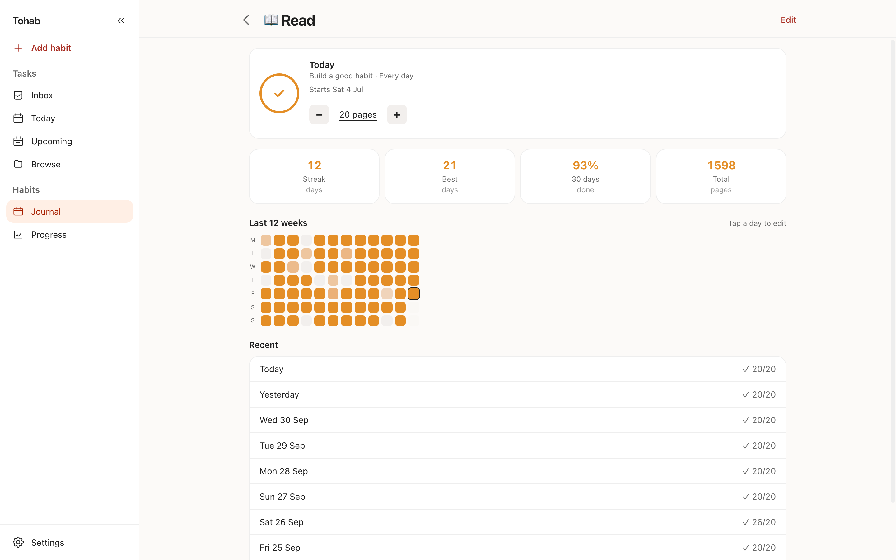

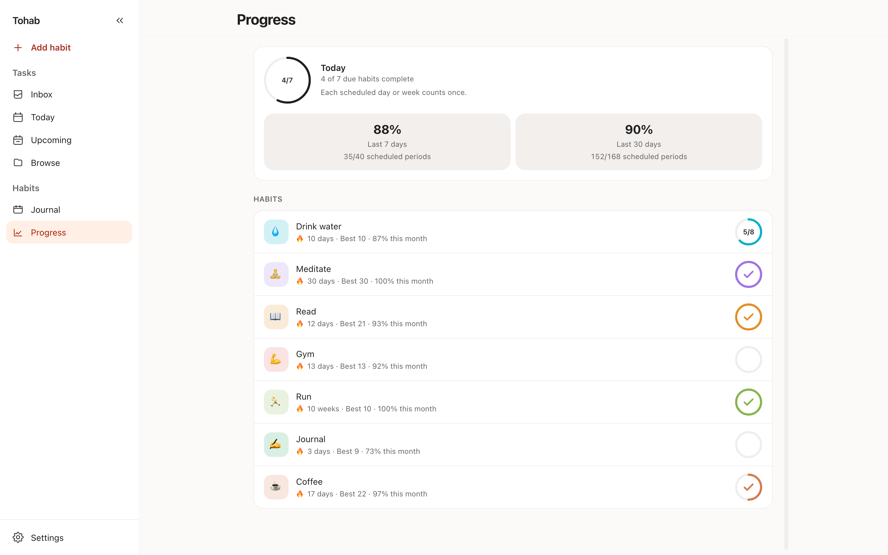

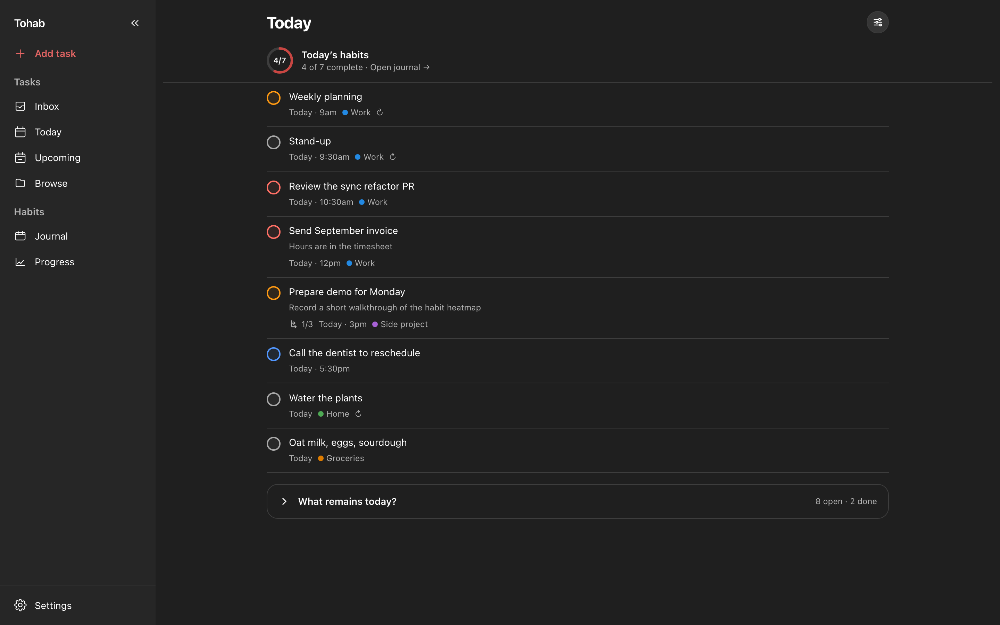

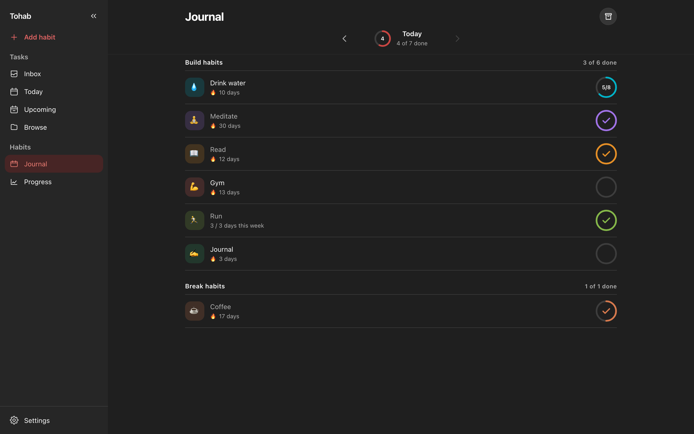
